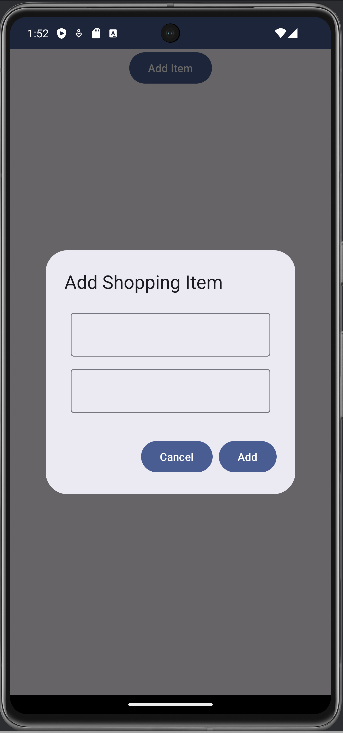
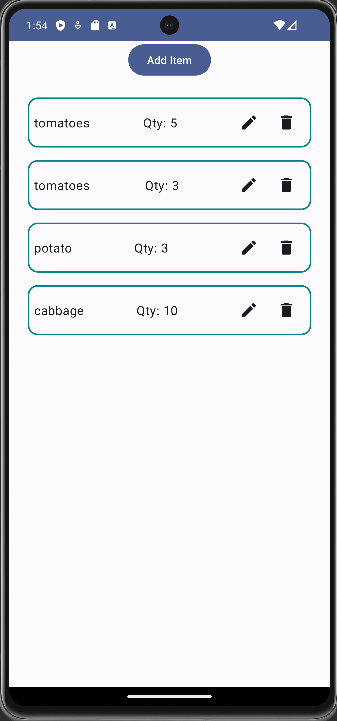
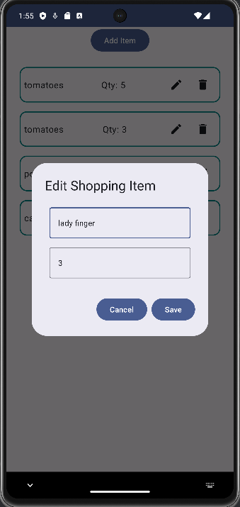
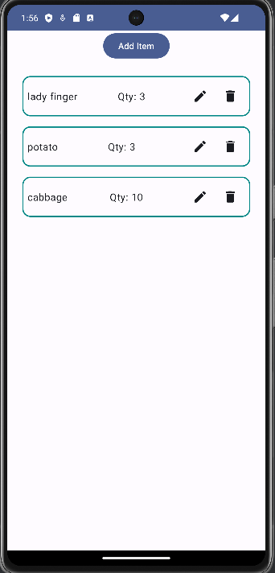

# My Shopping List App

My Shopping List App is a simple application built using Jetpack Compose for managing your shopping items. Whether you're at home, in the grocery store, or on the go, this app helps you keep track of the items you need to buy.

## Features

- **Add New Shopping Items**: Easily add new items to your shopping list by specifying the item name and quantity.
- **Edit Existing Items**: Update the name or quantity of any item on your list to keep it accurate and up to date.
- **Delete Items**: Remove items from your list when you no longer need them or have purchased them.

## Screenshots


&nbsp; &nbsp; &nbsp;

<!-- -->

&nbsp; &nbsp; &nbsp;



## Getting Started

To run this project locally, follow these steps:

1. **Clone the Repository**: Use `git clone` to clone this repository to your local machine.
    ```
    git clone https://github.com/nishkarsh25/MyShoppingListApp.git
    ```

2. **Open in Android Studio**: Open the project in Android Studio by selecting `File > Open` and navigating to the cloned directory.

3. **Run the App**: Run the app on an emulator or physical device by clicking the "Run" button in Android Studio.

## Dependencies

This project utilizes the following dependencies:

- **Jetpack Compose**: The modern toolkit for building native Android UI.
- **Material3**: The latest version of the Material Design components for Android.
- **AndroidX**: The Android extension libraries that provide backward-compatible versions of Android framework APIs.

## Contributing

Contributions to this project are welcome! If you find any bugs, have suggestions for improvements, or want to add new features, feel free to contribute. To contribute, follow these steps:

1. **Fork the Repository**: Fork this repository to your own GitHub account.
2. **Create a Branch**: Create a new branch for your changes (`git checkout -b feature-name`).
3. **Make Changes**: Make your changes to the codebase.
4. **Commit Changes**: Commit your changes with a descriptive commit message.
5. **Push Changes**: Push your changes to your forked repository (`git push origin feature-name`).
6. **Submit a Pull Request**: Submit a pull request from your forked repository to the main repository.

## License

This project is licensed under the MIT License. See the [LICENSE](LICENSE) file for details.
